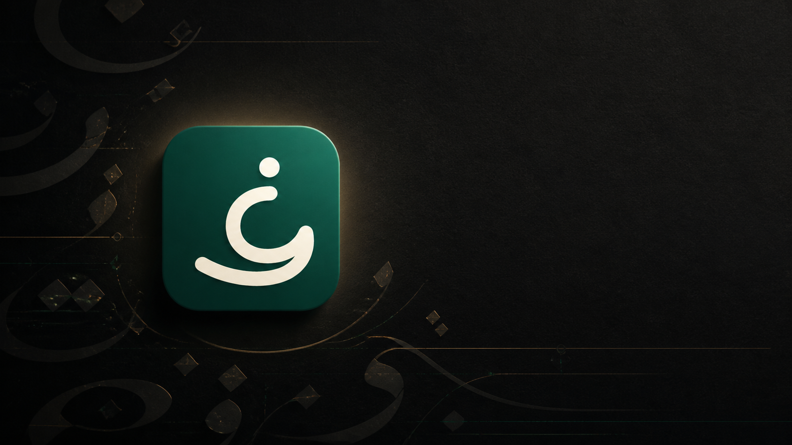
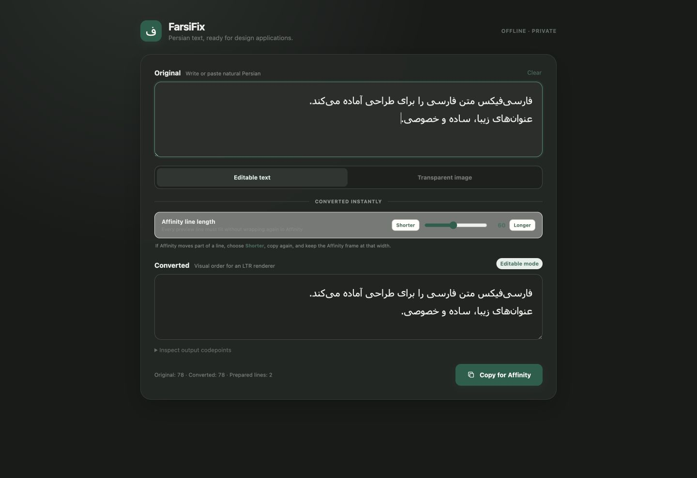
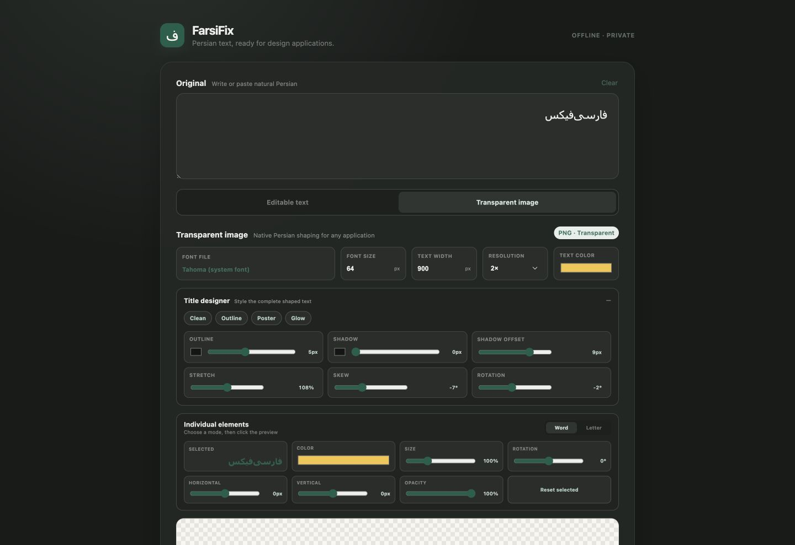

# FarsiFix downloads



This repository contains official public downloads and installation guidance for FarsiFix. The application source is maintained separately in a private repository and is not published here.

FarsiFix is an offline macOS utility that prepares editable Persian compatibility text for applications with deficient right-to-left layout, with Affinity Designer as its first validation target. It can also create transparent Persian title artwork using local fonts.

## Screenshots

### Editable compatibility text



### Transparent-image title designer



## Download the macOS beta

Download the DMG and its `.sha256` file from [FarsiFix 0.1.0 Beta](https://github.com/hanifb1360/FarsiFix-Releases/releases/tag/v0.1.0-beta).

This free beta is ad-hoc signed but **not notarized by Apple**. macOS will identify its developer as unverified and block the first normal launch.

## Verify the download

Put the DMG and checksum in the same folder, open Terminal in that folder, and run:

```sh
shasum -a 256 -c FarsiFix_0.1.0_universal.dmg.sha256
```

The result must say `FarsiFix_0.1.0_universal.dmg: OK`.

## Install and open it

1. Open the DMG and drag FarsiFix into Applications.
2. In Applications, try to open FarsiFix once. macOS will block this first attempt.
3. Open **System Settings → Privacy & Security**.
4. Scroll to the security section and select **Open Anyway** for FarsiFix.
5. Confirm **Open**. Later launches will work normally.

Apple documents this process in [Open a Mac app from an unidentified developer](https://support.apple.com/en-gb/102445). Managed work or school Macs may prevent this exception.

Do not disable Gatekeeper globally and do not use Terminal commands that remove quarantine protection.

## Privacy

FarsiFix has no backend, account, analytics, or network-dependent conversion. Input text remains local and is not persisted. Clipboard access occurs only after the user presses a copy button.

## Important Affinity limitation

Each prepared visual-order line must fit inside the Affinity text frame without wrapping again. If Affinity moves a fragment to the bottom of the text, return to FarsiFix, choose a shorter line length, and copy again.

## Artwork

Public product artwork is available in the [`artwork`](artwork) directory:

- Application icon in SVG and PNG formats
- Release hero artwork
- Repository social-preview artwork
- macOS DMG background and its high-resolution source

The core mark is the cream Persian `ف` on an emerald rounded square. Do not redraw, rotate, stretch, or place other marks inside the icon.
