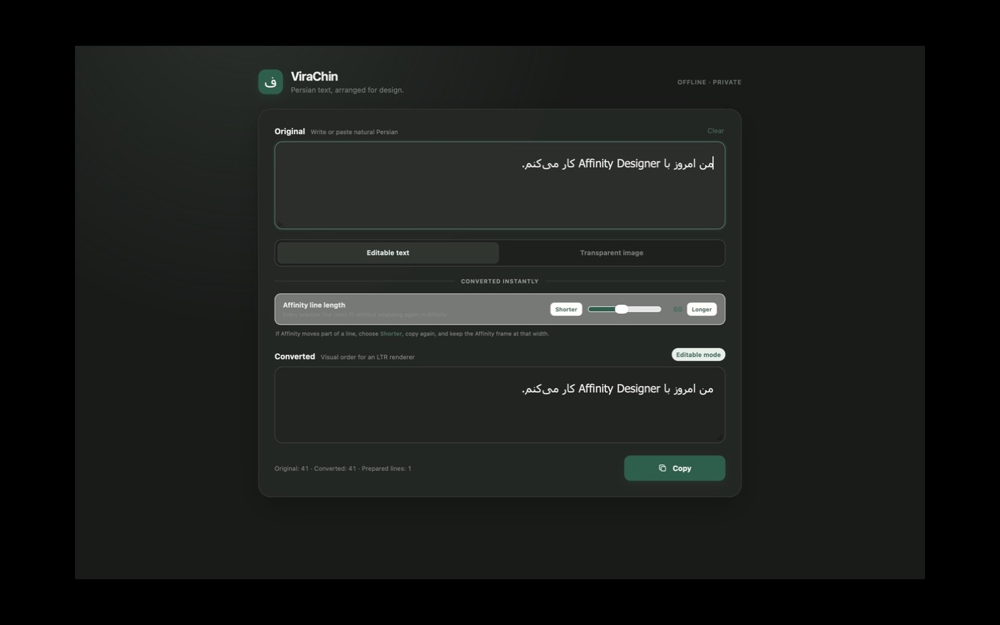
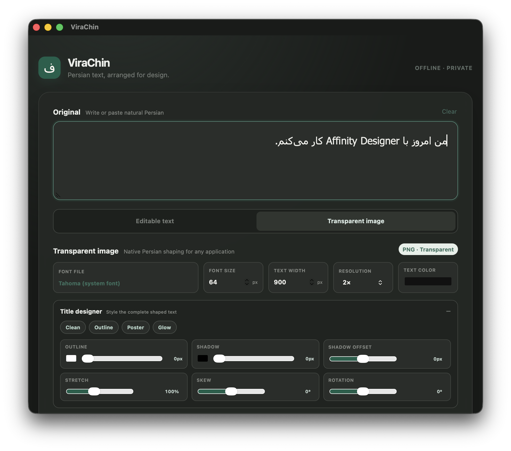

# ViraChin downloads


This repository contains the official public downloads and installation guidance for ViraChin. The application source is maintained separately in a private repository and is not published here.

Visit the [ViraChin website](https://hanifb1360.github.io/ViraChin-Releases/) for the product overview, screenshots, and download guidance.

ViraChin is an offline macOS and Windows utility that prepares editable Persian compatibility text for applications with deficient right-to-left layout, with Affinity Designer as its first validation target. It can also create transparent Persian title artwork using local fonts.

## Screenshots

### Editable compatibility text



### Transparent-image title designer



## Download the beta

Download [ViraChin 0.2.2 Beta](https://github.com/hanifb1360/ViraChin-Releases/releases/tag/v0.2.2-beta) for:

- macOS: universal build for Apple silicon and Intel
- Windows: 64-bit NSIS installer

Version 0.2.2 fixes decimal ordering across Persian, Arabic-Indic, and Latin digits, including the Arabic comma (`،`) commonly entered from Persian keyboards.

The older [0.1.0 Beta](https://github.com/hanifb1360/ViraChin-Releases/releases/tag/v0.1.0-beta) remains available as a historical build carrying the former **FarsiFix** name.

## Verify the download

Download the installer and its matching `.sha256` file from the same release.

### macOS

Put the DMG and checksum in the same folder, open Terminal in that folder, and run:

```sh
shasum -a 256 -c ViraChin_0.2.2_universal.dmg.sha256
```

The result must say `ViraChin_0.2.2_universal.dmg: OK`.

### Windows

Open PowerShell in the download folder and run:

```powershell
(Get-FileHash .\ViraChin_0.2.2_x64-setup.exe -Algorithm SHA256).Hash.ToLowerInvariant()
Get-Content .\ViraChin_0.2.2_x64-setup.exe.sha256
```

The two 64-character hashes must be identical. Stop if they differ.

## Safe installation

### macOS

The free beta is ad-hoc signed but **not notarized by Apple**. macOS will identify its developer as unverified and block the first normal launch.

1. Open the DMG and drag the app into Applications.
2. In Applications, try to open it once. macOS will block this first attempt.
3. Open **System Settings → Privacy & Security**.
4. Scroll to the security section and select **Open Anyway** for the app.
5. Confirm **Open**. Later launches will work normally.

Apple documents this process in [Open a Mac app from an unidentified developer](https://support.apple.com/en-gb/102445). Managed work or school Macs may prevent this exception.

Do not disable Gatekeeper globally and do not use Terminal commands that remove quarantine protection.

### Windows

The Windows beta is currently **unsigned**. Microsoft Defender SmartScreen may show **Windows protected your PC** because the app does not yet have publisher reputation.

1. Verify the checksum as described above.
2. Right-click the installer and select **Scan with Microsoft Defender**.
3. Open the installer. If SmartScreen blocks it, select **More info** and confirm the application is ViraChin and the publisher is unknown.
4. Select **Run anyway** only after the checksum matches and Defender reports no threat.
5. Complete the current-user installation; administrator access is not required.

Do not disable SmartScreen, Microsoft Defender, Smart App Control, or other Windows protections. Managed work or school computers may prohibit unsigned applications.

## Privacy

ViraChin has no backend, account, analytics, or network-dependent conversion. Input text remains local and is not persisted. Clipboard access occurs only after the user presses a copy button.

## Important Affinity limitation

Each prepared visual-order line must fit inside the Affinity text frame without wrapping again. If Affinity moves a fragment to the bottom of the text, return to ViraChin, choose a shorter line length, and copy again.

## Artwork

Public product artwork is available in the [`artwork`](artwork) directory:

- Application icon in SVG and PNG formats
- Release hero artwork
- Repository social-preview artwork
- macOS DMG background and its high-resolution source

The core mark is the cream Persian `و` on an emerald rounded square. Do not redraw, rotate, stretch, or place other marks inside the icon.
